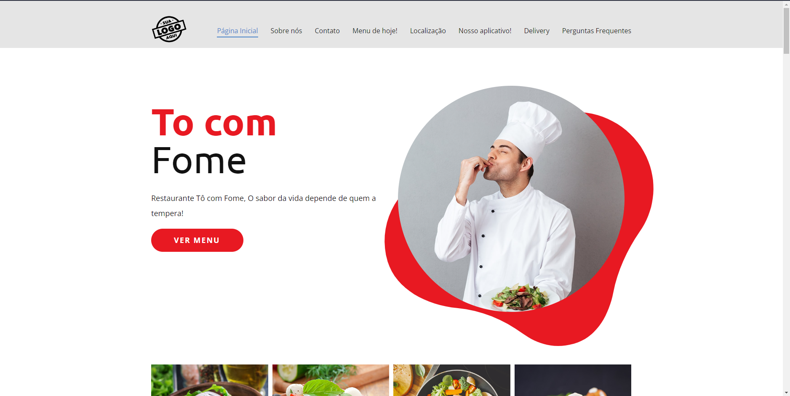

<h1 align="center">
  Demo-restaurante - Felipe Johnson ☕
</h1>

 

## 📝 Descrição 

Demo de restaurante, Restaurante Tô com Fome. O sabor da vida depende de quem a tempera!.  

- site final: [Demo-restaurante](https://demo-restaurante.vercel.app/)

 
 
## 🚀 Tecnologias 

Esse projeto foi desenvolvido com as seguintes tecnologias:

- JavaScript.
- TailwindCSS,
- CSS3.
- HTML5.

 

## 📚 Bibliotecas

- [Google Fonts](https://fonts.google.com/)
- [LazySizes](https://github.com/aFarkas/lazysizes)
- [jQuery](https://jquery.com/)

## 🔗 Links

 
 

 

-----

  <h3 align="center"> Developed by <a href="https://github.com/felipejohnson/">Felipe Johnson</a> ☕</h3>
